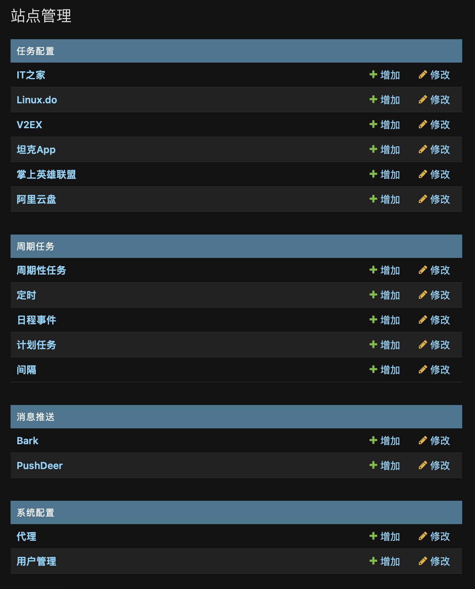

# qiandao

基于Django, Celery和Pydantic的签到框架



- 支持docker
- 支持通知
- 支持一次性任务
- 支持定时任务

## 依赖
Python >= 3.11

## 支持应用:
- v2ex
- linux.do
- it之家
- 坦克App
- 掌上英雄联盟

## 支持通知:
- Bark
- PushDeer

## 使用方式
### Docker Compose

```shell
git clone https://github.com/raisons/qiandao.git
docker compose up -d --build
```
